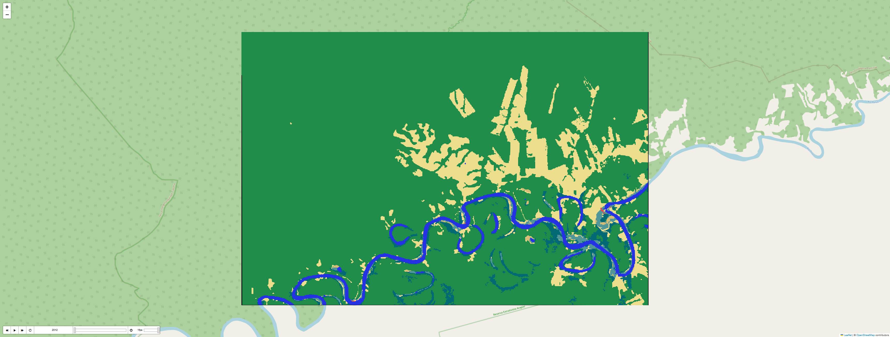

# 🌱 Land Cover Time Series Analysis using Google Earth Engine

[](https://colab.research.google.com/github/ana-isabellagf/gee-landcover-analysis/blob/main/notebooks/extract_lulc.ipynb)

This project automates the extraction, processing, and visualization of annual Land Use and Land Cover (LULC) data using **MapBiomas Collection 9**, processed via **Google Earth Engine (Python API)** and visualized through **Folium**.

It generates an interactive map displaying temporal changes in land cover for a user-defined area of interest (AOI), supporting decision-making in environmental monitoring and sustainable forest management.

---

## 📌 Objective

To extract, convert, and visualize LULC raster data as yearly classified polygons (vector format) for the period 1985–2023, based on custom AOI inputs. The output includes a time-enabled map compatible with web browsers.

---

## 🛠️ Tools & Technologies

- 🌍 **Google Earth Engine** (Python API)
- 🐍 Python: `geopandas`, `rasterio`, `folium`, `geemap`, `shapely`
- 🗺️ MapBiomas Collection 9
- 📦 Jupyter Notebook (Colab-compatible)
- 📁 Post-processing with `rasterio.mask` and `features.shapes`

---

## 📂 Project Structure

```
gee-landcover-analysis/
├── notebooks/
│   └── extract_lulc.ipynb               # Main notebook for extraction and visualization
├── docs/
│   └── LULC_time_series.html            # Interactive map (hosted via GitHub Pages)
├── data/
│   ├── aoi_lulc_dynamic.zip             # Area of Interest (shapefile zipped)
│   └── Codigos-da-legenda-colecao-9.xlsx # Class legend for MapBiomas
├── outputs/
│   └── preview_lulc_map.png             # Screenshot preview of final map
├── scripts/
│   └── extract_lulc.py                  # Modular extraction function (optional)
├── requirements.txt                     # Python dependencies
└── README.md                            # This file
```

---

## 📈 Output Overview

The final result is an interactive, temporal map showing LULC class changes year by year.

🖱️ **Click to explore the interactive map:**

🔗 [View Interactive LULC Map](https://anaisabellagf.github.io/gee-landcover-analysis/LULC_time_series.html)

<p align="center">
  
</p>

- 🗓️ Period: **2012 to 2022**
- 🎨 Colors follow MapBiomas legend
- 🧭 Geometry clipped to AOI
- 🧠 Converted raster classes to vector polygons using `rasterio.features.shapes`
- ⏱️ Time slider allows comparison across years

---

## 📋 How to Reproduce

1. Clone this repository
2. Upload your AOI as a zipped shapefile in `data/`
3. Update file paths in `notebooks/extract_lulc.ipynb`
4. Run all cells to extract, convert and render the interactive map
5. The result (`LULC_time_series.html`) will be saved in `docs/`

---

## 📎 References

- [MapBiomas Collection 9](https://mapbiomas.org/)
- [Brazil Data Cube Projections](https://brazil-data-cube.github.io/)
- [My Medium Article](https://medium.com/@aisabellaguimaraesf/série-temporal-do-uso-e-cobertura-do-solo-lulc-extração-e-visualização-52c59c5e0998)

---

## 👩‍💻 Author

**Ana Isabella Guimarães Ferreira**  
📧 aisabellaguimaraesf@gmail.com  
🔗 [LinkedIn](https://www.linkedin.com/in/ana-isabella-g-ferreira)

---

## 🪪 License

MIT License (or specify another)
